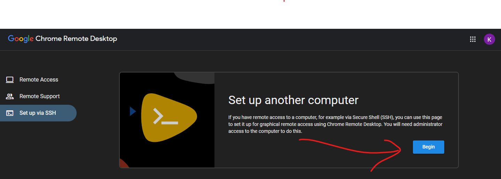
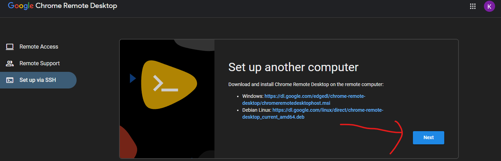
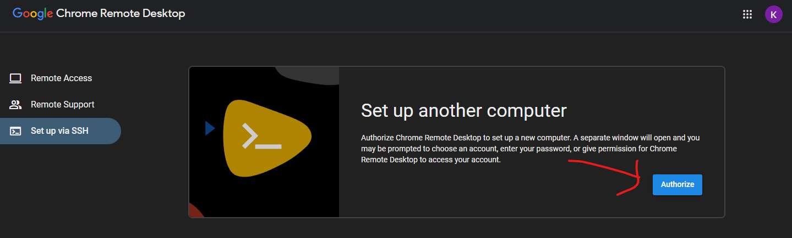
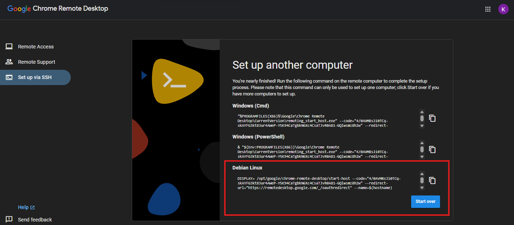
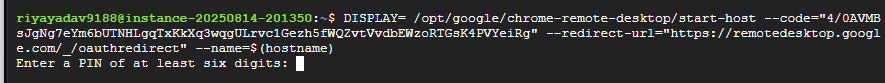
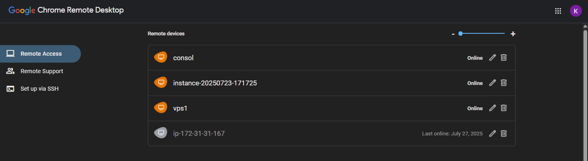

# Easy RDP from VPS

**Author:** Rachit Yadav

Super-short guide to set up Chrome Remote Desktop + Xfce on a Debian/Ubuntu VPS.

---

## 1) SSH

SSH Your VPS 

## 2) Paste & run (on VPS)

```bash
sudo apt update
sudo apt upgrade -y


wget https://dl.google.com/linux/direct/chrome-remote-desktop_current_amd64.deb
sudo apt install --assume-yes ./chrome-remote-desktop_current_amd64.deb

sudo apt update
sudo apt install --assume-yes xfce4 desktop-base
sudo DEBIAN_FRONTEND=noninteractive \
    apt install --assume-yes xscreensaver
sudo systemctl disable lightdm.service

echo "exec /usr/bin/xfce4-session" > ~/.chrome-remote-desktop-session

wget https://dl.google.com/linux/direct/google-chrome-stable_current_amd64.deb
sudo apt install --assume-yes ./google-chrome-stable_current_amd64.deb

sudo apt install dbus-x11

```

## 3) Register (headless)

* Open: `https://remotedesktop.google.com/headless` → **Begin** → authorize.



* Copy the provided command, paste it into the VPS terminal, run it.

* Now you will be asked to Create & confirm a **6-digit PIN** when asked. You’ll see "host started successfully".

## 4) Connect

* Open: `https://remotedesktop.google.com/access` click on your machine → sign in → click your VPS → **Connect** → enter PIN.


*Made by Rachit Yadav*
